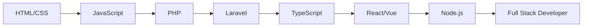

Hi My name is Rangga Figo Hidayat
======================================================================================================================================

<div align="center">
  


</div>

---

## 🚀 About Me

```typescript
const rangga = {
    location: "Indonesia 🇮🇩",
    role: "Full Stack Web Developer",
    languages: ["TypeScript", "PHP", "JavaScript", "Python"],
    frameworks: ["Laravel", "React", "Vue.js", "Node.js"],
    databases: ["MySQL", "PostgreSQL", "MongoDB"],
    tools: ["Docker", "Git", "VS Code", "Postman"],
    currentFocus: "Building scalable web applications",
    hobbies: ["Coding", "Learning new tech", "Open Source"],
    funFact: "I debug with console.log() and I'm not ashamed! 😄"
};
```

---

## 🛠️ Tech Arsenal

<div align="center">

### 💻 Languages


### 🎨 Frontend


### ⚙️ Backend


### 🗄️ Databases


### 🔧 Tools & Others


</div>

---

## 📊 GitHub Analytics

<div align="center">
  


</div>

<div align="center">
  
[](https://git.io/streak-stats)

</div>

---

## 🏆 GitHub Trophies

<div align="center">
  
[](https://github.com/ryo-ma/github-profile-trophy)

</div>

---

## 🌟 Featured Projects

<div align="center">

<a href="https://github.com/ranggacey/spotit">
  
</a>

<a href="https://github.com/ranggacey/presensi-smart">
  
</a>

</div>

---

## 📈 Contribution Graph

<div align="center">


</div>

---


---

## 💼 Experience & Skills

<details>
<summary>🎯 What I'm Currently Working On</summary>
<br>

- 🔭 Building modern web applications with **TypeScript** and **Laravel**
- 🌱 Learning advanced **React** patterns and **Vue 3** composition API
- 👯 Looking to collaborate on **open source projects**
- 💬 Ask me about **Web Development**, **Laravel**, or **TypeScript**
- ⚡ Fun fact: I love turning coffee into code! ☕→💻

</details>

<details>
<summary>📚 Learning Journey</summary>
<br>



</details>

---

## 🎵 Currently Vibing To

<div align="center">

<audio controls loop>
  <source src="https://open.spotify.com/intl-id/track/18nZWRpJIHzgb1SQr4ncwb?si=a6762696b35944fd" type="audio/mpeg">
  🎵 **Now Playing:** aespa - Supernova 🎵
</audio>

[](https://open.spotify.com/intl-id/track/18nZWRpJIHzgb1SQr4ncwb?si=a6762696b35944fd)

</div>

---

## 🌐 Connect With Me

<div align="center">

[](https://linkedin.com/in/rangga-figo-hidayat)
[](https://instagram.com/ranggacey)
[](https://facebook.com/ranggacey)
[](https://twitter.com/ranggacey)
[](mailto:rangga.figo@example.com)
[](https://ranggacey.dev)
[](https://discord.gg/ranggacey)

</div>


### 💭 Random Dev Quote


### 🎲 Fun Fact


---

**✨ "Code is like humor. When you have to explain it, it's bad." - Cory House**


</div>
